# Engify AI - System Architecture Documentation

## Table of Contents

1. [Overview](#overview)
2. [System Architecture](#system-architecture)
3. [Data Flow](#data-flow)
4. [Authentication & Authorization Flow](#authentication--authorization-flow)
5. [Component Architecture](#component-architecture)
6. [AI Provider Integration](#ai-provider-integration)
7. [Database Architecture](#database-architecture)
8. [API Architecture](#api-architecture)
9. [Security Architecture](#security-architecture)
10. [Scalability & Performance](#scalability--performance)

---

## Overview

Engify AI is a comprehensive prompt engineering platform built on **Next.js 14** (App Router), **MongoDB**, and a multi-provider AI integration system. The architecture follows **SOLID principles**, implements the **Repository Pattern**, and uses a **layered architecture** for maintainability and scalability.

### Technology Stack

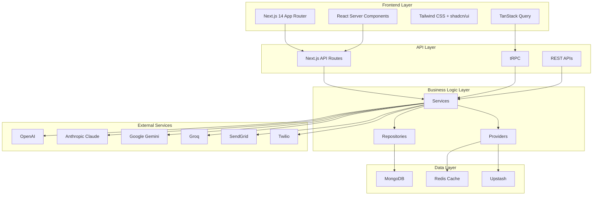

### Key Features

- **Multi-Provider AI Integration**: OpenAI, Anthropic, Google, Groq, and more
- **RBAC (Role-Based Access Control)**: Enterprise-grade permissions system
- **Repository Pattern**: Clean data access layer with type safety
- **Service Layer**: Business logic encapsulation
- **Provider Pattern**: Singleton resources (Auth, Database, Cache, Logging)
- **API Middleware**: Unified route wrapper with auth, RBAC, rate limiting, validation
- **Real-time Caching**: Multi-tier caching strategy with Redis/Upstash
- **Audit Logging**: Comprehensive security and compliance logging
- **MFA Support**: SMS-based multi-factor authentication
- **Multi-tenancy Ready**: Organization-based isolation

---

## System Architecture

### High-Level Architecture

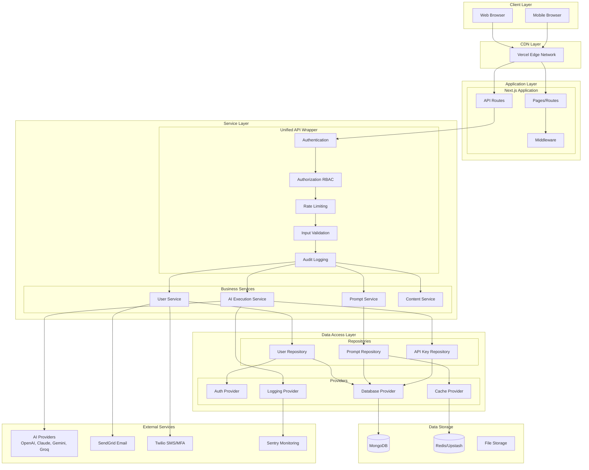

### Layered Architecture

The application follows a strict layered architecture:

```
┌─────────────────────────────────────────────────────────┐
│                   Presentation Layer                    │
│              (Next.js Pages & Components)               │
├─────────────────────────────────────────────────────────┤
│                     API Layer                           │
│        (Next.js API Routes + tRPC Routers)              │
├─────────────────────────────────────────────────────────┤
│                   Middleware Layer                      │
│   (withAPI: Auth, RBAC, Rate Limit, Validation)        │
├─────────────────────────────────────────────────────────┤
│                  Business Logic Layer                   │
│         (Services: User, Prompt, AI, Content)           │
├─────────────────────────────────────────────────────────┤
│                 Data Access Layer                       │
│      (Repositories: BaseRepository, Specialized)        │
├─────────────────────────────────────────────────────────┤
│                   Provider Layer                        │
│   (Singletons: Auth, Database, Cache, Logging)         │
├─────────────────────────────────────────────────────────┤
│                   Data Layer                            │
│          (MongoDB, Redis, File Storage)                 │
└─────────────────────────────────────────────────────────┘
```

**Layer Responsibilities:**

1. **Presentation Layer**: UI components, pages, client-side logic
2. **API Layer**: HTTP endpoints, route handlers, request/response formatting
3. **Middleware Layer**: Cross-cutting concerns (auth, validation, logging)
4. **Business Logic Layer**: Domain logic, business rules, orchestration
5. **Data Access Layer**: Database operations, query abstraction
6. **Provider Layer**: Singleton resources, dependency injection
7. **Data Layer**: Persistent storage, caching

---

## Data Flow

### Request Flow Diagram

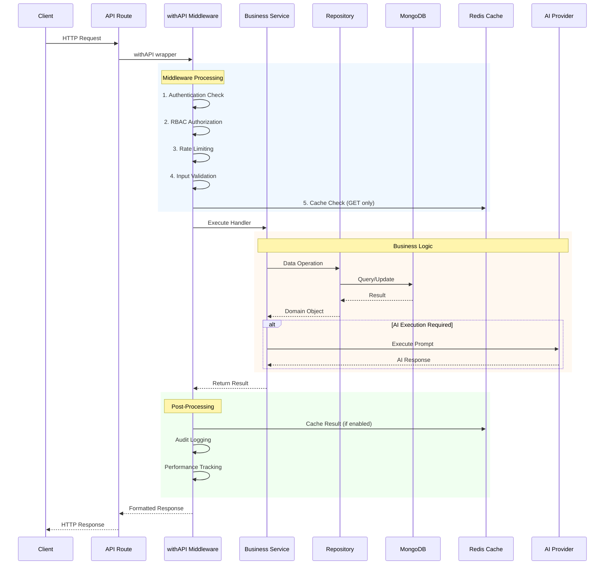

### Data Write Flow

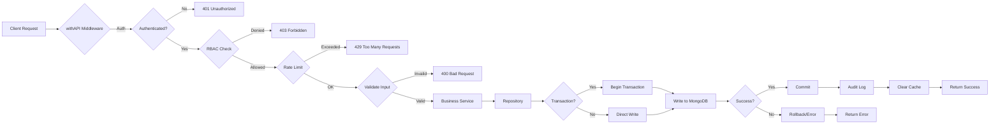

### Data Read Flow with Caching

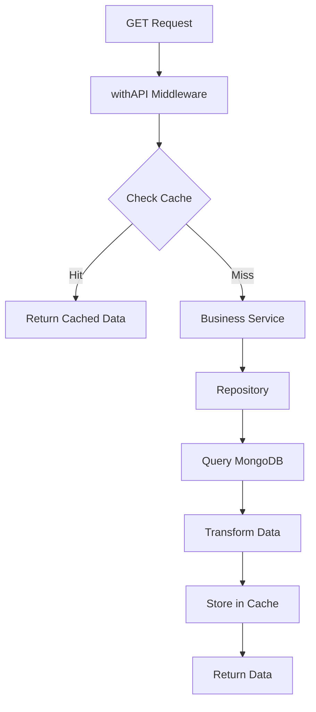

---

## Authentication & Authorization Flow

### Authentication Flow

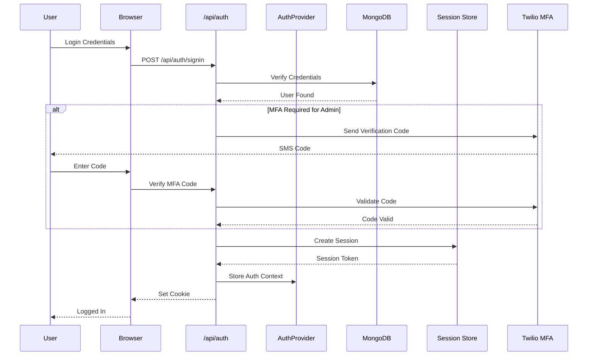

### RBAC Authorization Flow

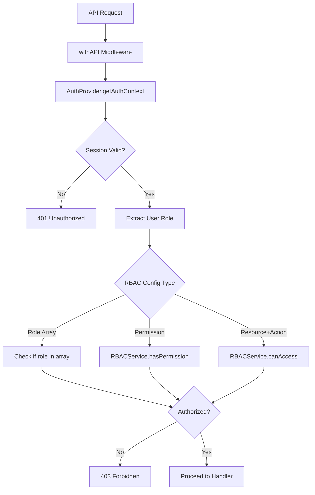

### Role-Permission Matrix

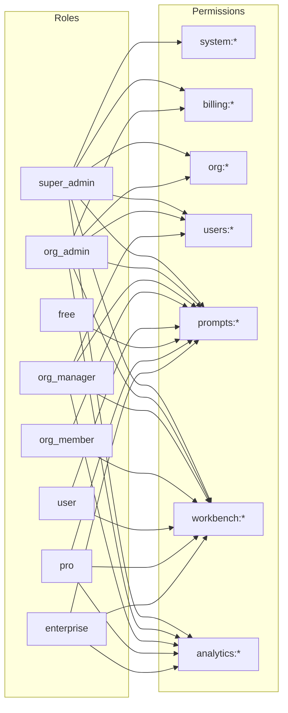

---

## Component Architecture

### Repository Pattern Implementation

The repository pattern provides a clean abstraction over data access:

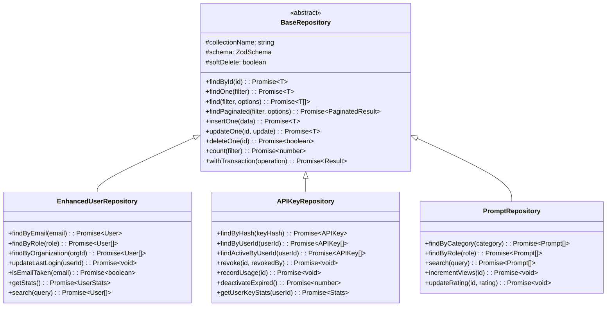

**BaseRepository Features:**
- Type-safe CRUD operations
- Pagination support
- Soft delete support
- Transaction support
- Error handling with logging
- Zod schema validation

### Service Layer Architecture

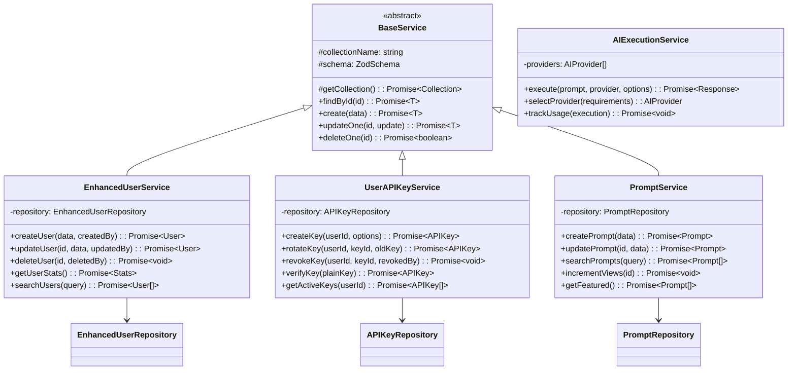

### Middleware Chain

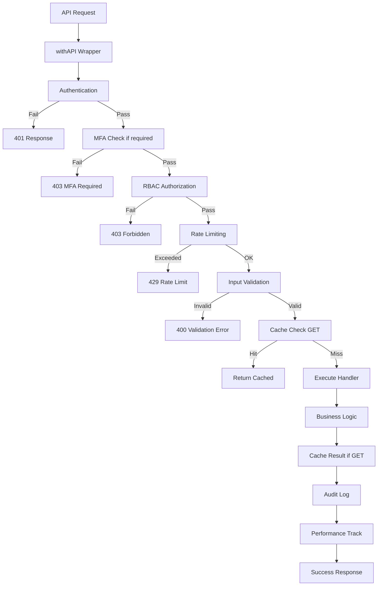

**Middleware Features:**
- Authentication check
- MFA verification (for admins)
- RBAC authorization
- Rate limiting with presets
- Zod schema validation
- Response caching (GET only)
- Audit logging
- Performance tracking
- Error handling

---

## AI Provider Integration

### AI Adapter Pattern

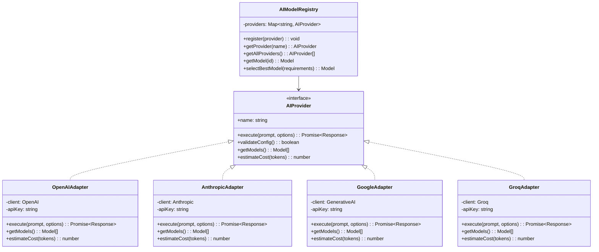

### AI Execution Flow

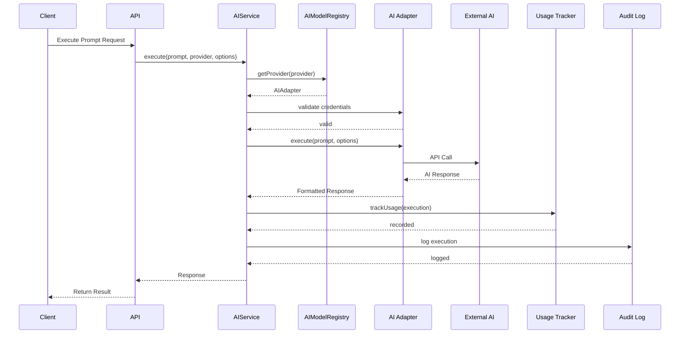

### Supported AI Providers

| Provider | Models | Tier | Context Window | Cost/1M Tokens |
|----------|--------|------|----------------|----------------|
| OpenAI | GPT-4o Mini, GPT-3.5 Turbo | Affordable | 128K | $0.15-$0.60 |
| Anthropic | Claude 3 Haiku, 3.5 Sonnet | Affordable-Premium | 200K | $0.25-$15.00 |
| Google | Gemini 1.5 Flash, Pro | Free-Premium | 1M-2M | $0.075-$5.00 |
| Groq | Llama 3.1 8B, 70B | Free-Affordable | 131K | $0.05-$0.79 |
| Perplexity | Sonar Small | Affordable | 127K | $0.20 |
| Together AI | Mixtral 8x7B | Affordable | 32K | $0.60 |
| Mistral | Mistral Small | Affordable | 32K | $1.00-$3.00 |

---

## Database Architecture

### MongoDB Collections Schema

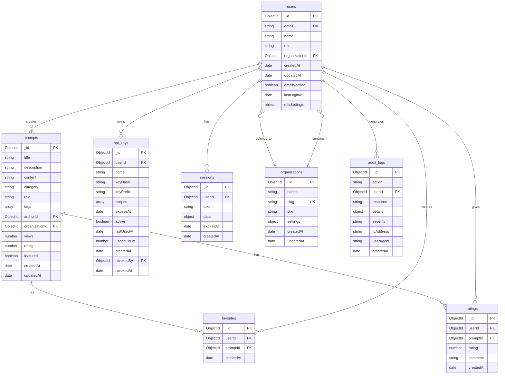

### Database Indexes

**Critical Indexes:**

```javascript
// users
db.users.createIndex({ email: 1 }, { unique: true })
db.users.createIndex({ organizationId: 1 })
db.users.createIndex({ role: 1 })
db.users.createIndex({ createdAt: -1 })

// prompts
db.prompts.createIndex({ category: 1, role: 1 })
db.prompts.createIndex({ featured: 1, createdAt: -1 })
db.prompts.createIndex({ organizationId: 1 })
db.prompts.createIndex({ title: "text", description: "text", content: "text" })

// api_keys
db.api_keys.createIndex({ userId: 1 })
db.api_keys.createIndex({ keyHash: 1 }, { unique: true })
db.api_keys.createIndex({ expiresAt: 1 })
db.api_keys.createIndex({ active: 1, userId: 1 })

// audit_logs
db.audit_logs.createIndex({ userId: 1, createdAt: -1 })
db.audit_logs.createIndex({ action: 1, createdAt: -1 })
db.audit_logs.createIndex({ severity: 1, createdAt: -1 })
```

---

## API Architecture

### API Route Structure

```
src/app/api/
├── auth/              # Authentication endpoints
│   ├── signin/
│   ├── signup/
│   └── signout/
├── users/             # User management
│   ├── [id]/
│   └── me/
├── prompts/           # Prompt CRUD
│   ├── [id]/
│   ├── search/
│   └── featured/
├── admin/             # Admin operations
│   ├── users/
│   ├── content/
│   └── analytics/
├── v2/                # API v2
│   └── users/
│       └── api-keys/
├── ai/                # AI execution
│   └── execute/
├── analytics/         # Analytics endpoints
├── webhooks/          # Webhook handlers
└── health/            # Health checks
```

### API Middleware Usage Example

```typescript
// Before: 68 lines of boilerplate
export async function POST(request: NextRequest) {
  try {
    const session = await auth();
    if (!session?.user?.id) {
      return NextResponse.json({ error: 'Unauthorized' }, { status: 401 });
    }

    const role = session.user.role;
    if (!['admin', 'super_admin'].includes(role || '')) {
      return NextResponse.json({ error: 'Forbidden' }, { status: 403 });
    }

    const rateLimitResult = await checkRateLimit(userId, 'user-create');
    if (!rateLimitResult.allowed) {
      return NextResponse.json({ error: 'Rate limit exceeded' }, { status: 429 });
    }

    const body = await request.json();
    const validated = CreateUserSchema.parse(body);

    const user = await createUser(validated);

    await auditLog({
      action: 'user_created',
      userId: session.user.id,
    });

    return NextResponse.json({ success: true, user });
  } catch (error) {
    logger.apiError('/api/users', error);
    return NextResponse.json({ error: 'Internal error' }, { status: 500 });
  }
}

// After: 10 lines with withAPI (85% reduction)
export const POST = withAPI({
  auth: true,
  rbac: ['admin', 'super_admin'],
  rateLimit: 'user-create',
  validate: CreateUserSchema,
  audit: { action: 'user_created' },
}, async ({ validated, userId }) => {
  const userService = createUserService();
  const user = await userService.createUser(validated, userId);
  return { success: true, user };
});
```

### tRPC Integration

```typescript
// src/server/routers/_app.ts
export const appRouter = router({
  user: userRouter,
  prompt: promptRouter,
  // ... other routers
});

export type AppRouter = typeof appRouter;
```

---

## Security Architecture

### Security Layers

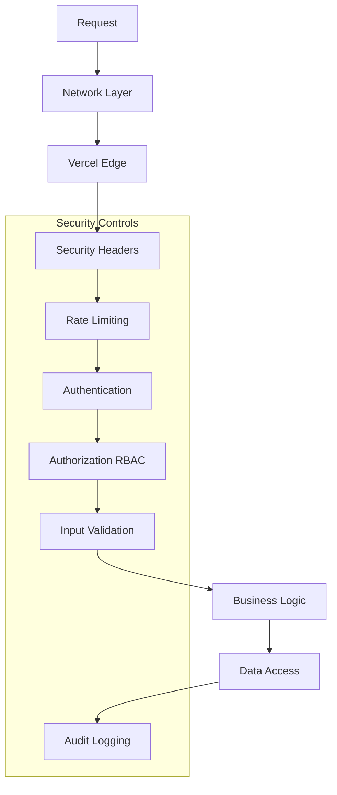

### Security Features

1. **Network Security**
   - HTTPS enforced (HSTS)
   - CSP headers
   - CORS configuration
   - DDoS protection via Vercel

2. **Authentication**
   - NextAuth.js session management
   - Secure password hashing (bcrypt)
   - MFA support (Twilio)
   - Session timeout

3. **Authorization**
   - RBAC with 8 role types
   - 60+ permission types
   - Resource-based access control
   - Organization isolation

4. **Input Validation**
   - Zod schema validation
   - SQL injection prevention (MongoDB)
   - XSS prevention
   - CSRF protection

5. **Data Protection**
   - API key encryption (AES-256)
   - Sensitive data masking
   - Secure session storage
   - PII handling compliance

6. **Audit & Monitoring**
   - Comprehensive audit logging
   - Sentry error tracking
   - Performance monitoring
   - Security event alerts

---

## Scalability & Performance

### Caching Strategy

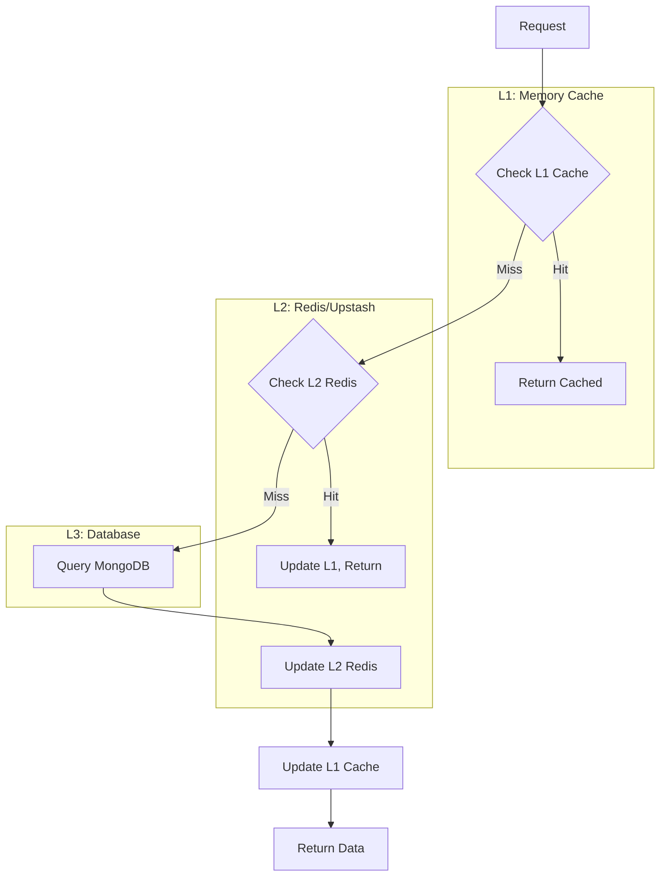

### Performance Optimizations

1. **Edge Caching**
   - Vercel Edge Network
   - ISR (Incremental Static Regeneration)
   - API response caching

2. **Database**
   - Connection pooling
   - Proper indexing
   - Query optimization
   - Aggregation pipelines

3. **API**
   - Rate limiting
   - Response compression
   - Pagination
   - Field selection

4. **Frontend**
   - React Server Components
   - Code splitting
   - Image optimization
   - Lazy loading

### Scalability Patterns

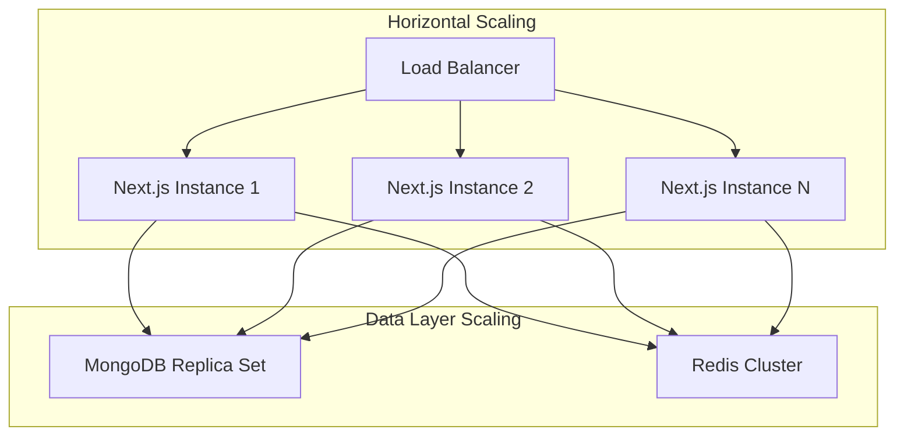

**Scaling Capabilities:**
- Stateless application design
- Session storage externalized
- Database connection pooling
- Redis-based caching
- CDN for static assets
- Async job processing ready

---

## Appendix

### Environment Variables

See `.env.example` for comprehensive environment configuration.

**Critical Variables:**
- `MONGODB_URI`: Database connection
- `NEXTAUTH_SECRET`: Session encryption
- `OPENAI_API_KEY`, `ANTHROPIC_API_KEY`, etc.: AI providers
- `REDIS_URL`: Caching layer
- `SENDGRID_API_KEY`: Email service

### Monitoring & Observability

- **Error Tracking**: Sentry
- **Analytics**: Vercel Analytics, Google Analytics
- **Logging**: Winston with structured logging
- **Performance**: Next.js built-in metrics
- **Uptime**: Vercel monitoring

### Disaster Recovery

- MongoDB Atlas automated backups (point-in-time recovery)
- Critical data export scripts
- Environment variable backup
- Deployment rollback capability
- Database restore procedures documented

---

**Document Version**: 1.0
**Last Updated**: 2025-01-17
**Maintained By**: Engineering Team
