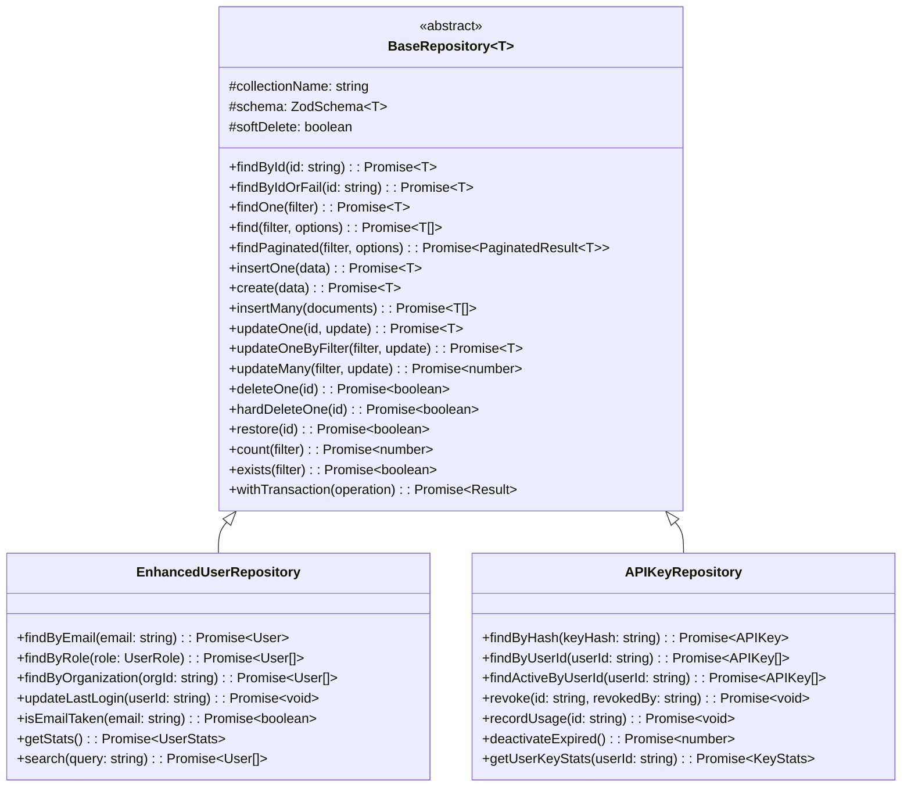
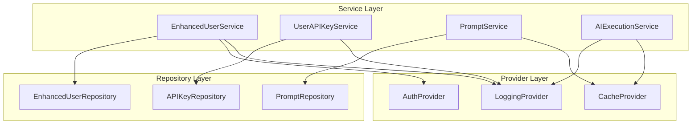
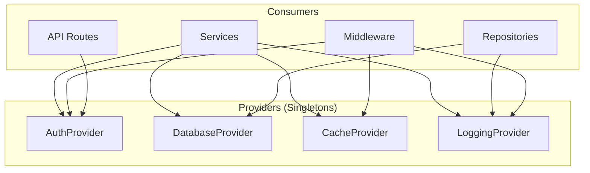
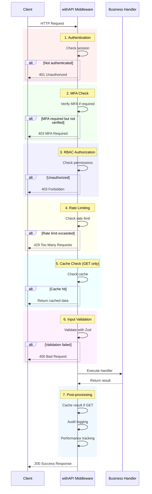
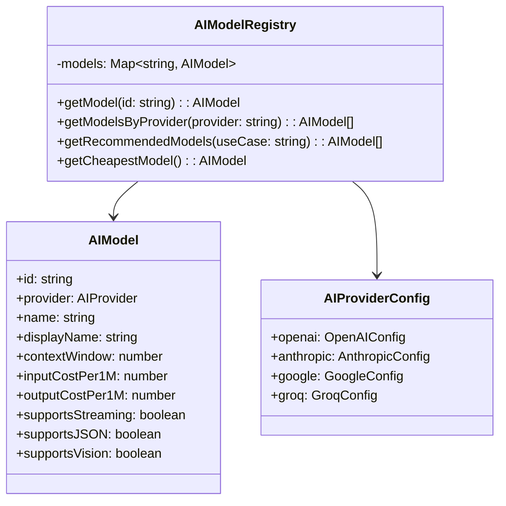

# Component Documentation Guide

## Table of Contents

1. [Repository Pattern](#repository-pattern)
2. [Service Layer](#service-layer)
3. [Provider Pattern](#provider-pattern)
4. [Middleware System](#middleware-system)
5. [AI Adapter Pattern](#ai-adapter-pattern)
6. [Factory Pattern](#factory-pattern)
7. [Error Handling](#error-handling)

---

## Repository Pattern

The Repository Pattern provides a clean abstraction layer over data access, ensuring consistent database operations across the application.

### BaseRepository

**Location:** `/src/lib/repositories/BaseRepository.ts`

**Purpose:** Generic repository providing type-safe CRUD operations with built-in features.

**Features:**
- Type-safe operations via TypeScript generics
- Zod schema validation
- Pagination support
- Soft delete capability
- Transaction support
- Error handling with structured logging

**Class Diagram:**



### Usage Examples

**Creating a Repository:**

```typescript
import { BaseRepository } from '@/lib/repositories/BaseRepository';
import { z } from 'zod';

// Define schema
const UserSchema = z.object({
  _id: z.instanceof(ObjectId).optional(),
  email: z.string().email(),
  name: z.string(),
  role: z.enum(['user', 'admin', 'super_admin']),
  createdAt: z.date(),
  updatedAt: z.date(),
});

type User = z.infer<typeof UserSchema>;

// Create repository
class UserRepository extends BaseRepository<User> {
  constructor() {
    super('users', UserSchema, { softDelete: true });
  }

  // Add custom methods
  async findByEmail(email: string): Promise<User | null> {
    return this.findOne({ email } as Filter<User>);
  }

  async isEmailTaken(email: string): Promise<boolean> {
    return this.exists({ email } as Filter<User>);
  }
}
```

**Using the Repository:**

```typescript
const userRepo = new UserRepository();

// Create user
const user = await userRepo.create({
  email: 'user@example.com',
  name: 'John Doe',
  role: 'user',
  createdAt: new Date(),
  updatedAt: new Date(),
});

// Find user
const foundUser = await userRepo.findByEmail('user@example.com');

// Update user
const updated = await userRepo.updateOne(user._id!.toString(), {
  name: 'Jane Doe',
});

// Paginated query
const result = await userRepo.findPaginated(
  { role: 'user' } as Filter<User>,
  { page: 1, limit: 20 }
);

// Soft delete
await userRepo.deleteOne(user._id!.toString());

// Restore
await userRepo.restore(user._id!.toString());
```

**Transaction Support:**

```typescript
await userRepo.withTransaction(async (session) => {
  // Create user
  const user = await userRepo.create({
    email: 'user@example.com',
    name: 'John Doe',
    role: 'user',
    createdAt: new Date(),
    updatedAt: new Date(),
  }, session);

  // Create API key for user
  const apiKeyRepo = new APIKeyRepository();
  await apiKeyRepo.create({
    userId: user._id,
    name: 'Default Key',
    keyHash: 'hash',
    createdAt: new Date(),
  }, session);

  // Both operations committed or rolled back together
});
```

---

## Service Layer

The Service Layer encapsulates business logic and orchestrates operations across repositories.

### BaseService

**Location:** `/src/lib/services/BaseService.ts`

**Purpose:** Abstract base class for all business services.

**Architecture:**



### EnhancedUserService

**Location:** `/src/lib/services/EnhancedUserService.ts`

**Responsibilities:**
- User CRUD operations
- Email validation
- Role management
- Statistics aggregation
- Audit logging

**Usage Example:**

```typescript
import { EnhancedUserService } from '@/lib/services/EnhancedUserService';

const userService = new EnhancedUserService();

// Create user
const user = await userService.createUser(
  {
    email: 'user@example.com',
    name: 'John Doe',
    role: 'user',
  },
  'admin-user-id' // createdBy
);

// Update user
await userService.updateUser(
  user._id!.toString(),
  { name: 'Jane Doe' },
  'admin-user-id' // updatedBy
);

// Get statistics
const stats = await userService.getUserStats();
console.log(`Total users: ${stats.total}`);
console.log(`Active users: ${stats.active}`);

// Search users
const results = await userService.searchUsers('john');
```

### UserAPIKeyService

**Location:** `/src/lib/services/UserAPIKeyService.ts`

**Responsibilities:**
- Secure API key generation
- Atomic key rotation
- Key revocation
- Usage tracking
- Audit logging

**Key Features:**
- Cryptographically secure key generation
- Hash-based storage (never store plain keys)
- Atomic rotation (old key invalidated when new key created)
- Automatic expiration handling

**Usage Example:**

```typescript
import { UserAPIKeyService } from '@/lib/services/UserAPIKeyService';

const apiKeyService = new UserAPIKeyService();

// Create API key
const { plainKey, ...apiKey } = await apiKeyService.createKey(
  'user-id',
  {
    name: 'Production API Key',
    expiresIn: 90, // days
    scopes: ['prompts:read', 'prompts:write'],
  }
);

// IMPORTANT: plainKey is only returned once
console.log('Save this key:', plainKey);

// Rotate key (atomic operation)
const newKey = await apiKeyService.rotateKey(
  'user-id',
  apiKey._id!.toString(),
  plainKey, // old key for verification
  'user-id' // rotatedBy
);

// Verify key
const verified = await apiKeyService.verifyKey(plainKey);
if (verified) {
  console.log('Key is valid');
  // Record usage
  await apiKeyService.recordUsage(verified._id!.toString());
}

// Revoke key
await apiKeyService.revokeKey(
  'user-id',
  apiKey._id!.toString(),
  'admin-id' // revokedBy
);

// Get active keys
const activeKeys = await apiKeyService.getActiveKeys('user-id');
```

---

## Provider Pattern

Providers implement the Singleton Pattern to manage shared resources efficiently.

### Architecture



### AuthProvider

**Location:** `/src/lib/providers/AuthProvider.ts`

**Purpose:** Centralized authentication state management.

**Features:**
- Session retrieval
- User ID extraction
- Role checking
- MFA verification
- Auth context caching

**Usage:**

```typescript
import { authProvider } from '@/lib/providers/AuthProvider';

// Get session
const session = await authProvider.getSession();

// Get user ID (throws if not authenticated)
const userId = await authProvider.requireUserId();

// Get full auth context
const context = await authProvider.getAuthContext();
if (context) {
  console.log('User ID:', context.userId);
  console.log('Role:', context.userRole);
  console.log('MFA verified:', context.mfaVerified);
}

// Check role
const isAdmin = await authProvider.hasRole('admin');
```

### DatabaseProvider

**Location:** `/src/lib/providers/DatabaseProvider.ts`

**Purpose:** MongoDB connection management with pooling and transactions.

**Features:**
- Connection pooling
- Transaction support
- Collection access
- Health checking

**Usage:**

```typescript
import { dbProvider } from '@/lib/providers/DatabaseProvider';

// Get database instance
const db = await dbProvider.getDb();

// Get collection
const users = await dbProvider.getCollection('users');

// Use transactions
await dbProvider.withTransaction(async (session) => {
  await users.insertOne(
    { name: 'John' },
    { session }
  );
  await users.updateOne(
    { name: 'Jane' },
    { $set: { active: true } },
    { session }
  );
  // Both operations committed together
});

// Health check
const isHealthy = await dbProvider.isHealthy();
```

### CacheProvider

**Location:** `/src/lib/providers/CacheProvider.ts`

**Purpose:** In-memory caching with TTL support.

**Features:**
- TTL (Time To Live) support
- Automatic cleanup
- Hit/miss tracking
- Pattern-based deletion
- Type-safe operations

**Usage:**

```typescript
import { cacheProvider } from '@/lib/providers/CacheProvider';

// Set cache with TTL
await cacheProvider.set('user:123', userData, 300); // 5 minutes

// Get from cache
const user = await cacheProvider.get<User>('user:123');

// Get or compute
const data = await cacheProvider.getOrSet(
  'expensive-data',
  async () => {
    // This only runs on cache miss
    return await expensiveOperation();
  },
  300 // TTL in seconds
);

// Increment (useful for rate limiting)
const count = await cacheProvider.increment('rate:user:123', 60);

// Delete pattern (e.g., clear all user caches)
await cacheProvider.deletePattern('user:*');

// Clear all cache
await cacheProvider.clear();

// Get stats
const stats = cacheProvider.getStats();
console.log(`Hit rate: ${stats.hitRate}%`);
```

### LoggingProvider

**Location:** `/src/lib/providers/LoggingProvider.ts`

**Purpose:** Structured logging with context enrichment.

**Features:**
- Multiple log levels
- Context enrichment
- API error tracking
- Audit integration
- Child loggers

**Usage:**

```typescript
import { loggingProvider } from '@/lib/providers/LoggingProvider';

// Basic logging
loggingProvider.info('User logged in', { userId: '123' });
loggingProvider.warn('Rate limit approaching', { userId: '123', count: 95 });
loggingProvider.error('Database error', error, { operation: 'createUser' });

// API logging
loggingProvider.apiError('/api/users', error, {
  userId: '123',
  statusCode: 500,
  duration: 1234,
});

loggingProvider.apiSuccess('/api/users', 200, 123, {
  userId: '123',
  method: 'POST',
});

// Audit logging
await loggingProvider.audit('user_created', {
  userId: '123',
  severity: 'info',
  details: { email: 'user@example.com' },
});

// Child logger with persistent context
const logger = loggingProvider.child({
  service: 'UserService',
  operation: 'createUser',
});

logger.info('Starting user creation');
logger.debug('Validating email');
logger.info('User created successfully');
```

---

## Middleware System

The unified API middleware (`withAPI`) eliminates boilerplate code and ensures consistency.

### withAPI Wrapper

**Location:** `/src/lib/middleware/api-route-wrapper.ts`

**Purpose:** Comprehensive middleware for API routes.

**Processing Flow:**



### Usage Examples

**Basic Authentication:**

```typescript
import { withAPI } from '@/lib/middleware/api-route-wrapper';

export const GET = withAPI({
  auth: true,
}, async ({ userId, request }) => {
  // userId is guaranteed to exist
  const data = await fetchUserData(userId);
  return { success: true, data };
});
```

**With RBAC:**

```typescript
// Role-based
export const POST = withAPI({
  auth: true,
  rbac: ['admin', 'super_admin'],
}, async ({ validated, userId }) => {
  // Only admins can access
  return await createUser(validated);
});

// Permission-based
export const DELETE = withAPI({
  auth: true,
  rbac: { permission: 'users:delete' },
}, async ({ params }) => {
  return await deleteUser(params.id);
});

// Resource-based
export const PUT = withAPI({
  auth: true,
  rbac: { resource: 'users', action: 'update' },
}, async ({ params, validated }) => {
  return await updateUser(params.id, validated);
});
```

**With Rate Limiting:**

```typescript
// Use preset
export const POST = withAPI({
  auth: true,
  rateLimit: 'user-create', // 5 per 5 minutes
}, handler);

// Custom limit
export const POST = withAPI({
  auth: true,
  rateLimit: { max: 10, window: 60 }, // 10 per minute
}, handler);
```

**With Validation:**

```typescript
import { z } from 'zod';

const CreateUserSchema = z.object({
  email: z.string().email(),
  name: z.string().min(2),
  role: z.enum(['user', 'admin']),
});

export const POST = withAPI({
  auth: true,
  validate: CreateUserSchema,
}, async ({ validated }) => {
  // validated is typed as CreateUserSchema
  return await createUser(validated);
});
```

**With Caching:**

```typescript
// Default 5 minute cache
export const GET = withAPI({
  auth: true,
  cache: true,
}, handler);

// Custom cache
export const GET = withAPI({
  auth: true,
  cache: { ttl: 300, key: 'custom-key' },
}, handler);
```

**Complete Example:**

```typescript
import { withAPI } from '@/lib/middleware/api-route-wrapper';
import { z } from 'zod';

const CreateUserSchema = z.object({
  email: z.string().email(),
  name: z.string().min(2),
  role: z.enum(['user', 'admin']),
});

export const POST = withAPI({
  auth: true,
  rbac: ['admin', 'super_admin'],
  rateLimit: 'user-create',
  validate: CreateUserSchema,
  audit: { action: 'user_created', severity: 'info' },
}, async ({ validated, userId, request, params, context }) => {
  const userService = new EnhancedUserService();

  const user = await userService.createUser(validated, userId);

  return {
    success: true,
    user,
    meta: {
      createdBy: userId,
      duration: Date.now() - context.startTime,
    },
  };
});
```

---

## AI Adapter Pattern

The AI Adapter Pattern provides a unified interface for multiple AI providers.

### Implementation



### Usage Example

```typescript
import { AI_MODELS, getModel, getRecommendedModels } from '@/lib/ai/providers';

// Get specific model
const model = getModel('gpt-4o-mini');
console.log(`Cost: $${model.inputCostPer1M}/1M tokens`);

// Get recommended models for use case
const chatModels = getRecommendedModels('chat');
const codeModels = getRecommendedModels('code');

// Execute with specific provider
const response = await executeAI({
  prompt: 'Hello, world!',
  provider: 'openai',
  model: 'gpt-4o-mini',
  options: {
    temperature: 0.7,
    maxTokens: 1000,
  },
});
```

---

## Factory Pattern

Factories provide centralized object creation with dependency injection.

### ServiceFactory

**Location:** `/src/lib/factories/ServiceFactory.ts`

```typescript
import { ServiceFactory } from '@/lib/factories';

// Create individual services
const userService = ServiceFactory.createUserService();
const apiKeyService = ServiceFactory.createAPIKeyService();

// Create all user services at once
const { userService, apiKeyService } = ServiceFactory.createUserServices();

// Configure singleton mode (services reused across requests)
ServiceFactory.configure({ useSingletons: true });
```

### RepositoryFactory

**Location:** `/src/lib/factories/RepositoryFactory.ts`

```typescript
import { RepositoryFactory } from '@/lib/factories';

// Type-safe repository creation
const userRepo = RepositoryFactory.create('user');
const apiKeyRepo = RepositoryFactory.create('apiKey');
const promptRepo = RepositoryFactory.create('prompt');

// Enable singleton mode
RepositoryFactory.enableSingletons();
```

### ValidatorFactory

**Location:** `/src/lib/factories/ValidatorFactory.ts`

```typescript
import { ValidatorFactory, CommonValidators } from '@/lib/factories';

// Common validators
const emailSchema = CommonValidators.email();
const passwordSchema = CommonValidators.strongPassword();
const paginationSchema = CommonValidators.pagination();

// Domain-specific schemas
const { createUserSchema, updateUserSchema } = ValidatorFactory.createUserSchemas();
const { createAPIKeySchema, rotateAPIKeySchema } = ValidatorFactory.createAPIKeySchemas();
```

---

## Error Handling

### Error Types

```typescript
class APIError extends Error {
  statusCode: number;
  code: string;

  constructor(message: string, statusCode: number, code: string) {
    super(message);
    this.statusCode = statusCode;
    this.code = code;
    this.name = 'APIError';
  }
}

class ValidationError extends APIError {
  errors: z.ZodError;

  constructor(errors: z.ZodError) {
    super('Validation failed', 400, 'VALIDATION_ERROR');
    this.errors = errors;
  }
}

class AuthenticationError extends APIError {
  constructor(message = 'Authentication required') {
    super(message, 401, 'AUTHENTICATION_ERROR');
  }
}

class AuthorizationError extends APIError {
  constructor(message = 'Insufficient permissions') {
    super(message, 403, 'AUTHORIZATION_ERROR');
  }
}

class NotFoundError extends APIError {
  constructor(resource: string) {
    super(`${resource} not found`, 404, 'NOT_FOUND');
  }
}
```

### Error Handling Pattern

```typescript
// In services
async createUser(data: CreateUserInput): Promise<User> {
  try {
    // Check if email exists
    const exists = await this.repository.isEmailTaken(data.email);
    if (exists) {
      throw new APIError('Email already taken', 409, 'EMAIL_EXISTS');
    }

    return await this.repository.create(data);
  } catch (error) {
    loggingProvider.error('Failed to create user', error, { data });
    throw error;
  }
}

// In API routes with withAPI
export const POST = withAPI({
  auth: true,
  validate: CreateUserSchema,
}, async ({ validated }) => {
  // Errors are automatically caught and formatted
  const user = await userService.createUser(validated);
  return { success: true, user };
});

// Manual error handling in API routes
export async function POST(request: NextRequest) {
  try {
    // Business logic
  } catch (error) {
    if (error instanceof APIError) {
      return NextResponse.json(
        { error: error.message, code: error.code },
        { status: error.statusCode }
      );
    }

    return NextResponse.json(
      { error: 'Internal server error' },
      { status: 500 }
    );
  }
}
```

---

**Document Version**: 1.0
**Last Updated**: 2025-01-17
**Maintained By**: Engineering Team
