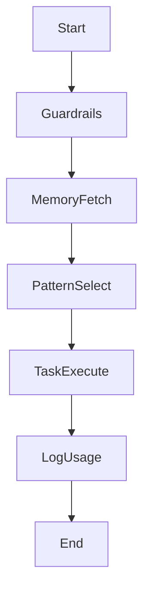

# MCP Integration Roadmap

Defines how Engify applications, agents, and external clients consume the new MCP services once the base server is ready.

## Internal Consumers

### 1. Engify Workbench (Next.js)

- Use Server Actions to request `MCPAccessToken`.
- Establish WebSocket tunnel to orchestrator for streaming tool invocations.
- Expose UI toggles for:
  - Guardrail acknowledgement logs.
  - Pattern recommendations preview.
  - Memory snapshots (recent history, artifacts).
- Store execution transcripts for analytics (Mongo or Postgres).

### 2. Agent Workflows (RCA, PD Plan, etc.)

- Agents run in Node (LangGraph or custom orchestrator).
- Each agent obtains short-lived token.
- Standard agent template:

- Provide TypeScript SDK wrapper (`@engify/mcp-client`) for simplified calls.

### 3. Content Generation Pipelines

- Use memory service to store training context or audit results.
- Guardrail checks before writing to production docs (e.g., pattern updates).

## External Clients

### 1. Claude Desktop / Windsurf / Cursor

- Publish configuration profiles:
  - Endpoint URLs (`https://mcp.engify.ai/guardrails`, etc.).
  - Required scopes and instructions (“Call `check_guardrails` before editing”).
- Provide packaging via `.mcpconfig` file.
- Offer onboarding guide in docs + video.

### 2. Chrome DevTools MCP (future)

- Combine with Engify orchestrator to capture DOM context for front-end tasks.
- Example: pattern recommending DOM refactoring guidance.

### 3. Partner Integrations (e.g., Slack App)

- Build thin layer that calls orchestrator and streams results back to chat.
- Enforce rate limits per integration token.

## Rollout Phases

1. **Alpha (Internal)**
   - Only Engify engineers (single org).
   - Hard-coded tokens; minimal rate limits.
   - Goal: validate guardrail + memory interplay.

2. **Private Beta (Select users)**
   - Issue tokens via admin dashboard.
   - Enable telemetry dashboards (usage, cost).
   - Provide support channel.

3. **Public Beta**
   - Self-serve token issuance (Pro plan).
   - Document upgrade path, usage quotas.
   - Monitor support tickets for guardrail false positives.

4. **General Availability**
   - Marketplace listing (if applicable).
   - Marketing campaigns showcasing pattern orchestration.
   - Add enterprise support packages (SLAs, self-host instructions).

## Dependencies

- SDK for Node/Python (shared orchestrator client).
- OAuth/JWT issuance from core Engify app.
- ClickHouse or equivalent analytics pipeline (Phase 2).
- Support tooling: admin dashboard, usage tracker.

## Open Questions

- Do we allow self-hosted customers to connect to Engify guardrails/patterns while running their own memory service?
- How do we anonymize memories when using them for analytics (GDPR)?
- Should we instrument feature flags to toggle guardrail strictness per org?
- What governance is required for pattern marketplace contributions before they appear in MCP?

