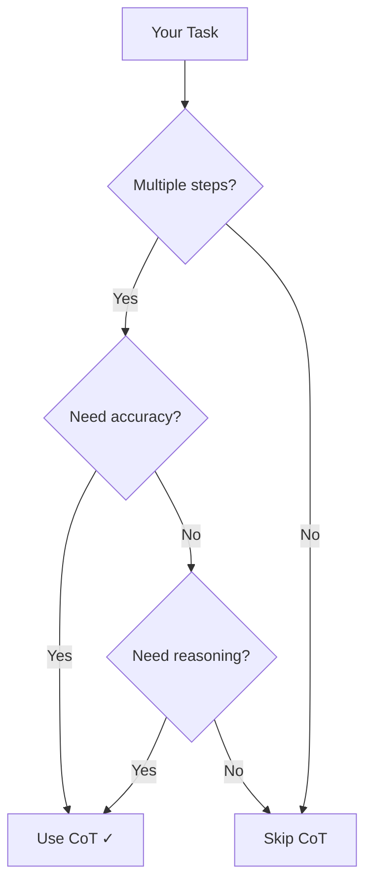

# Pattern Tutorials - Specification

## 🎯 Goal
Transform our 23 patterns from reference docs into interactive tutorials that teach through practice.

**Core Principle:** "Show, Practice, Master"

---

## 📚 Tutorial Structure

### **Standard Template**
Every pattern tutorial follows this structure:

```
/learn/patterns/[pattern-name]
├─ 1. What is it?          (2 min read)
├─ 2. When to use it       (Decision tree)
├─ 3. How it works         (Step-by-step)
├─ 4. Real examples        (3-5 from our library)
├─ 5. Try it yourself      (Interactive practice)
├─ 6. Common mistakes      (What to avoid)
├─ 7. Advanced techniques  (Level up)
└─ 8. Next steps           (Related patterns)
```

---

## 🎓 Section Details

### **1. What is it?** (2 min read)
**Goal:** Quick, clear explanation

**Format:**
```markdown
# Chain of Thought

## One-Sentence Summary
Break complex problems into step-by-step reasoning to improve AI accuracy.

## The Problem It Solves
AI often jumps to conclusions without showing its work, leading to errors in complex tasks.

## How It Helps
By asking AI to "think step-by-step," you get:
- More accurate results
- Transparent reasoning
- Easier to spot errors
- Better for complex problems

## Quick Example
❌ Bad: "Calculate 23 * 47"
✅ Good: "Calculate 23 * 47. Think step-by-step."

Result: AI shows 23 * 47 = 23 * 40 + 23 * 7 = 920 + 161 = 1,081
```

---

### **2. When to use it** (Decision tree)
**Goal:** Help users decide if this pattern fits their need

**Format:**
```markdown
## When to Use Chain of Thought

Use it when:
✅ Problem requires multiple steps
✅ Accuracy is critical
✅ You need to verify reasoning
✅ Problem is math/logic heavy
✅ You want to teach the AI

Don't use it when:
❌ Simple, one-step tasks
❌ Creative writing (kills flow)
❌ Speed is more important than accuracy
❌ Output length is constrained

## Decision Tree

```

---

### **3. How it works** (Step-by-step)
**Goal:** Teach the mechanics

**Format:**
```markdown
## How Chain of Thought Works

### Step 1: Add the instruction
Add "Think step-by-step" or "Let's break this down" to your prompt.

### Step 2: AI shows reasoning
The AI will explicitly show its thinking process.

### Step 3: Verify the steps
You can check each step for correctness.

### Step 4: Get the answer
The final answer comes after the reasoning.

## Anatomy of a CoT Prompt
```
[Context]
You are a financial analyst.

[Task]
Calculate the ROI of this marketing campaign.

[CoT Trigger]
Think step-by-step and show your work.

[Data]
- Investment: $50,000
- Revenue: $75,000
- Duration: 3 months
```

## What Happens Behind the Scenes
1. AI breaks problem into sub-problems
2. Solves each sub-problem
3. Shows intermediate results
4. Combines into final answer
```

---

### **4. Real examples** (3-5 from our library)
**Goal:** Show pattern in action with real prompts

**Format:**
```markdown
## Real Examples from Our Library

### Example 1: Code Debugging
**Prompt:** [Link to actual prompt in library]
```
Debug this Python function. Think step-by-step:
1. What is the function supposed to do?
2. What is it actually doing?
3. Where is the bug?
4. How to fix it?

[code snippet]
```

**Why it works:** CoT forces systematic debugging process

**Result:** AI found the off-by-one error in line 23

---

### Example 2: Business Analysis
**Prompt:** [Link to actual prompt in library]
```
Analyze this product launch failure. Think step-by-step:
1. What were the goals?
2. What actually happened?
3. What went wrong?
4. What should we do differently?

[launch data]
```

**Why it works:** CoT structures the post-mortem

**Result:** AI identified 3 root causes with evidence

---

### Example 3: System Design
**Prompt:** [Link to actual prompt in library]
```
Design a caching layer. Think step-by-step:
1. What are the requirements?
2. What are the options?
3. What are the trade-offs?
4. What's the recommendation?

[requirements]
```

**Why it works:** CoT ensures thorough analysis

**Result:** AI provided detailed comparison with recommendation
```

---

### **5. Try it yourself** (Interactive practice)
**Goal:** Hands-on practice with feedback

**Format:**
```markdown
## Practice Exercise

### Your Challenge
You're a product manager analyzing user churn. Write a CoT prompt to:
1. Identify the top 3 churn reasons
2. Quantify the impact of each
3. Recommend solutions

### Your Data
- 1,000 users churned last month
- Exit survey responses (provided)
- Usage analytics (provided)

### Try It
[Interactive prompt editor]
- Template provided
- Real-time AI execution
- Feedback on your prompt

### What Good Looks Like
[Show example solution]
[Explain why it's effective]
[Common mistakes to avoid]

### Your Turn
[Submit your prompt]
[Get AI feedback]
[See how others solved it]
```

**Interactive Components:**
- Prompt editor with syntax highlighting
- "Run" button to execute with AI
- Side-by-side comparison (your output vs. example)
- AI feedback on your prompt quality
- Community solutions (anonymized)

---

### **6. Common mistakes** (What to avoid)
**Goal:** Prevent common pitfalls

**Format:**
```markdown
## Common Mistakes

### ❌ Mistake 1: Too vague
**Bad:** "Think step-by-step"
**Why:** AI doesn't know what steps to take
**Fix:** "Think step-by-step: 1) Identify the problem, 2) List solutions, 3) Evaluate each"

### ❌ Mistake 2: Too many steps
**Bad:** "Think step-by-step through these 15 steps..."
**Why:** AI gets lost, output too long
**Fix:** Break into 3-5 major steps

### ❌ Mistake 3: Wrong context
**Bad:** Using CoT for creative writing
**Why:** Kills creativity and flow
**Fix:** Use CoT for analytical tasks only

### ❌ Mistake 4: No verification
**Bad:** Accepting AI's steps without checking
**Why:** AI can make logical errors
**Fix:** Verify each step makes sense

### ❌ Mistake 5: Inconsistent format
**Bad:** Mixing CoT with other patterns randomly
**Why:** Confuses the AI
**Fix:** Be consistent within a prompt
```

---

### **7. Advanced techniques** (Level up)
**Goal:** Show advanced usage

**Format:**
```markdown
## Advanced Techniques

### Technique 1: Multi-Stage CoT
Break complex problems into multiple CoT sequences.

**Example:**
```
Stage 1: Analyze the problem (CoT)
Stage 2: Generate solutions (CoT)
Stage 3: Evaluate solutions (CoT)
Stage 4: Make recommendation (CoT)
```

### Technique 2: CoT + Few-Shot
Combine CoT with examples for better results.

**Example:**
```
Example 1: [Problem] → [CoT reasoning] → [Answer]
Example 2: [Problem] → [CoT reasoning] → [Answer]
Now your turn: [New problem] → Think step-by-step...
```

### Technique 3: Verification CoT
Use CoT twice: once to solve, once to verify.

**Example:**
```
First pass: Solve the problem step-by-step
Second pass: Verify each step is correct
```

### Technique 4: Constrained CoT
Limit the number or format of steps.

**Example:**
```
Think step-by-step using exactly 3 steps:
1. [Step 1]
2. [Step 2]
3. [Step 3]
```
```

---

### **8. Next steps** (Related patterns)
**Goal:** Guide learning progression

**Format:**
```markdown
## What to Learn Next

### If you liked Chain of Thought, try:

#### 1. Reflection Pattern
**Why:** Adds self-critique to CoT reasoning
**Difficulty:** ⭐⭐⭐
**Time:** 15 minutes
[Start Tutorial →]

#### 2. Tree of Thoughts
**Why:** Explores multiple reasoning paths
**Difficulty:** ⭐⭐⭐⭐
**Time:** 20 minutes
[Start Tutorial →]

#### 3. Self-Consistency
**Why:** Runs CoT multiple times for reliability
**Difficulty:** ⭐⭐⭐⭐
**Time:** 20 minutes
[Start Tutorial →]

### Learning Path
```
Beginner → Intermediate → Advanced
  CoT   →   Reflection  →  Tree of Thoughts
```

### Your Progress
- ✅ Chain of Thought (Complete)
- ⏳ Reflection Pattern (Next)
- 🔒 Tree of Thoughts (Locked)
- 🔒 Self-Consistency (Locked)
```

---

## 🎨 UI Components

### **Pattern Card**
```tsx
<PatternCard
  name="Chain of Thought"
  difficulty="Beginner"
  timeToLearn="10 minutes"
  useCases={["Debugging", "Analysis", "Math"]}
  popularity={95} // % of users who found it useful
  completionRate={78} // % who finished tutorial
/>
```

### **Interactive Editor**
```tsx
<PromptEditor
  template={chainOfThoughtTemplate}
  onRun={executeWithAI}
  showFeedback={true}
  allowSave={true}
  showCommunity={true}
/>
```

### **Progress Tracker**
```tsx
<ProgressBar
  current={3}
  total={8}
  sections={[
    "What is it?",
    "When to use",
    "How it works",
    "Examples",
    "Practice",
    "Mistakes",
    "Advanced",
    "Next steps"
  ]}
/>
```

---

## 📊 Analytics

### **Per-Tutorial Metrics**
```typescript
interface TutorialMetrics {
  // Engagement
  views: number;
  completions: number;
  completionRate: number;
  avgTimeSpent: number;
  
  // Learning
  practiceAttempts: number;
  practiceSuccessRate: number;
  mistakesViewed: number;
  advancedViewed: number;
  
  // Progression
  nextPatternClicks: number;
  returnRate: number;
  
  // Quality
  helpfulVotes: number;
  feedbackSubmitted: number;
  avgRating: number;
}
```

---

## 🚀 Implementation Plan

### **Phase 1: Core 5 Patterns** (Week 1)
Priority patterns with highest usage:
1. ✅ Chain of Thought
2. ✅ Few-Shot Learning
3. ✅ Role Prompting
4. ✅ Reflection Pattern
5. ✅ CRAFT Framework

### **Phase 2: Next 10 Patterns** (Week 2-3)
6. Tree of Thoughts
7. Self-Consistency
8. Constitutional AI
9. RAG Pattern
10. Prompt Chaining
11. Meta Prompting
12. Socratic Method
13. Persona Pattern
14. Template Pattern
15. Iterative Refinement

### **Phase 3: Remaining 8 Patterns** (Week 4)
16. KERNEL Framework
17. Cognitive Verifier
18. Flipped Interaction
19. Game Play
20. Infinite Generation
21. Output Automater
22. Recipe Pattern
23. Visualization Generator

---

## 💡 Content Creation Strategy

### **Option A: AI-Assisted** (Fast, needs review)
1. Use GPT-4 to generate tutorial content
2. Human review and edit
3. Add real examples from library
4. Test with users

### **Option B: Human-Written** (Slow, high quality)
1. Subject matter expert writes
2. Editor reviews
3. Designer formats
4. Test with users

### **Option C: Hybrid** (Recommended)
1. AI generates first draft
2. SME reviews and enhances
3. Add real examples
4. User testing
5. Iterate based on feedback

**Estimated Time per Tutorial:**
- AI-Assisted: 2-3 hours
- Human-Written: 8-10 hours
- Hybrid: 4-5 hours

---

## 🔗 Integration Points

### **Link from Pattern Pages**
```tsx
// On /patterns/chain-of-thought
<Button href="/learn/patterns/chain-of-thought">
  📚 Take the Tutorial
</Button>
```

### **Link from Prompts**
```tsx
// On prompts using CoT pattern
<Badge>Uses Chain of Thought</Badge>
<Link href="/learn/patterns/chain-of-thought">
  Learn this pattern →
</Link>
```

### **Link from Role Pages**
```tsx
// On /for-engineers
<Section title="Recommended Patterns">
  <PatternCard name="Chain of Thought" />
  <PatternCard name="Code Review" />
</Section>
```

---

*Last Updated: November 7, 2024*  
*Status: Specification Draft*  
*Owner: Content Team*
